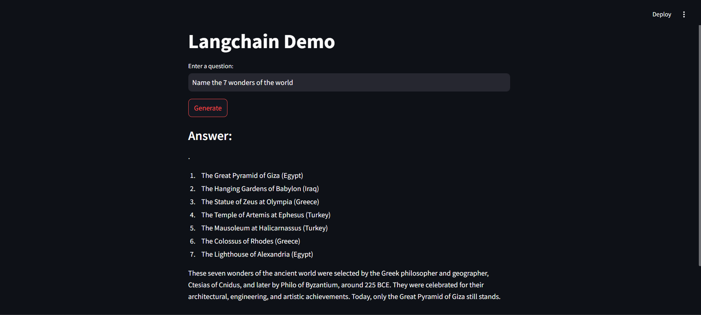

# Q&A Interface - AI-Powered

This application is an intuitive Q&A interface that allows users to ask questions and receive answers generated by an AI model. It harnesses the capabilities of modern language models to deliver accurate and relevant responses.

## Key Features

- **Interactive Q&A**: Engage with the app by asking questions and receiving AI-generated answers.
- **Real-Time Responses**: Experience instant responses powered by advanced language models.

## Technology Stack

- **LangChain**: Facilitates integration and management of language model interactions.
- **Hugging Face**: Provides access to pre-trained language models.
- **Streamlit**: Powers the web application interface.
- **Python**: Handles the core application logic.

## How to Use

- **Run the App**

    - Open your web browser and go to `http://localhost:8501`.
    - Type your question into the text area.
    - Click the "Generate" button to receive an AI-generated answer.

## Preview

