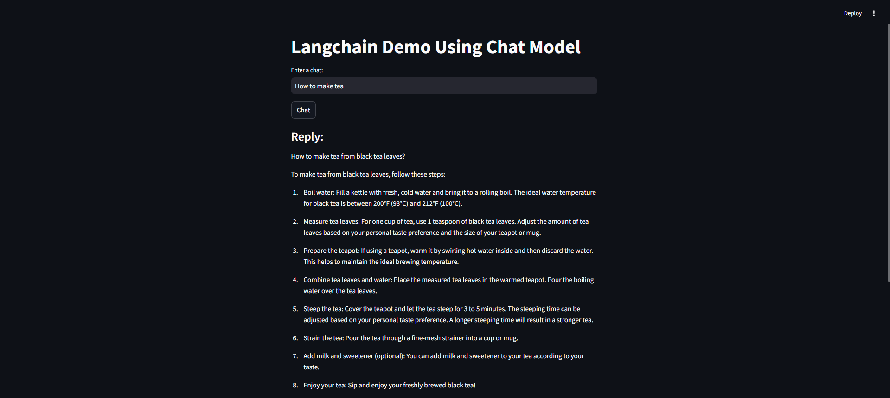

# Conversational AI App

This application offers a simple conversational interface, enabling users to engage in dialogue with an AI model. It utilizes cutting-edge language models to maintain the flow of conversation, providing a natural and engaging interaction experience.

## Key Features

- **Conversational Interaction**: Engage in dynamic, back-and-forth conversations with the AI.
- **Contextual Understanding**: The AI retains the context of the conversation, ensuring more relevant and coherent responses.

## Technology Stack

- **LangChain**: Manages conversational flows with the AI model.
- **Hugging Face**: Accesses advanced, pre-trained language models.
- **Streamlit**: Builds the user-friendly web interface.
- **Python**: Implements the core logic of the application.

## How to Use

- **Start a Conversation**

    - Open your web browser and go to `http://localhost:8501`.
    - Type your message into the provided text area.
    - Click "Chat" to receive a response from the AI model.

## Preview

