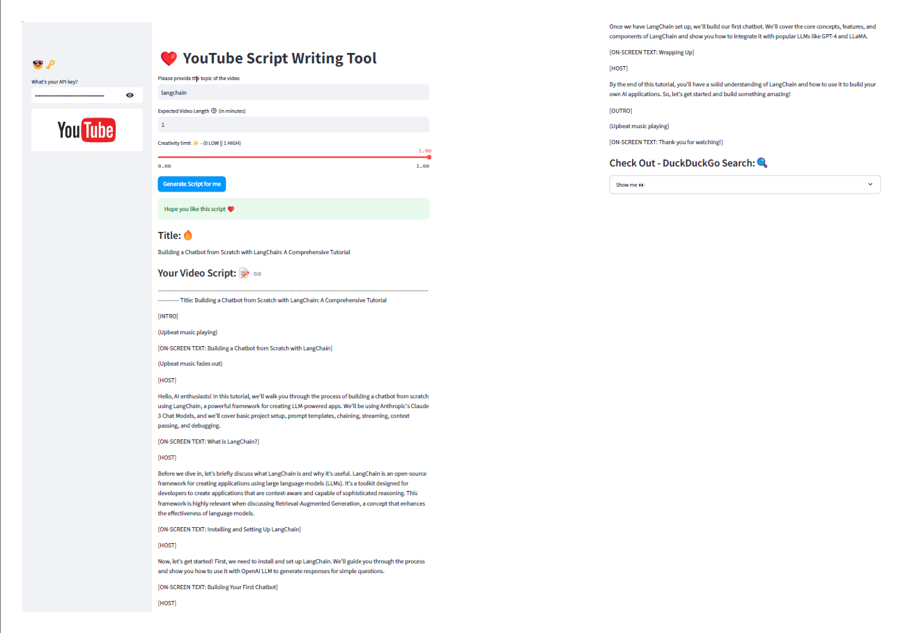

# YouTube Script Writing Tool

The YouTube Script Writing Tool is a Streamlit-based application that helps you create engaging video scripts using the OpenAI API. By providing details like the video topic, desired length, and creativity level, the app generates a customized script ready for use in your YouTube content.

## Key Features

- **Custom UI Elements**: Enhanced user interface with specially styled buttons.
- **Secure API Key Handling**: Manage your OpenAI API key securely using Streamlit’s session state.
- **Interactive Sidebar**: Easily input your OpenAI API key via the sidebar for seamless integration.
- **Dynamic User Inputs**: Specify the video topic, preferred length, and creativity level.
- **AI-Driven Script Generation**: Automatically generate a detailed script using the OpenAI API.
- **Result Presentation**: Instantly view the generated title, script, and suggested search results within the app.

## How to Use

1. Launch the application in your web browser using the provided Streamlit URL.
2. Enter your OpenAI API key in the sidebar for secure access.
3. Input the following details:
    - **Video Topic**: Define the subject matter of your video.
    - **Expected Length**: Specify the desired duration for the script.
    - **Creativity Level**: Adjust the creativity to suit your style and audience.
4. Click **"Generate Script for me"** to create your video script.
5. Review the generated title, full script, and related search engine suggestions directly in the app interface.

## Visual Preview

